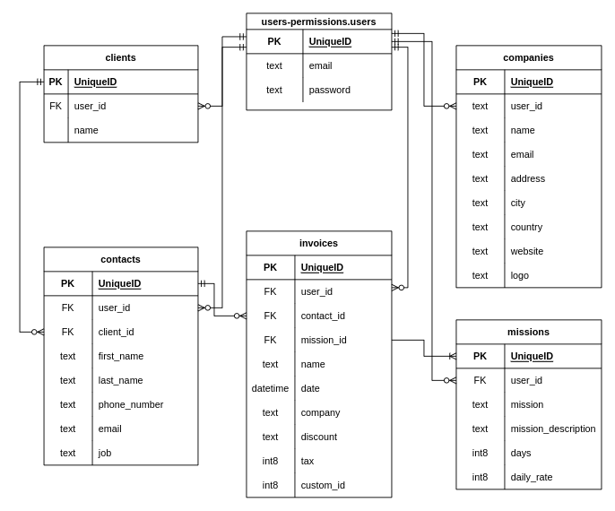
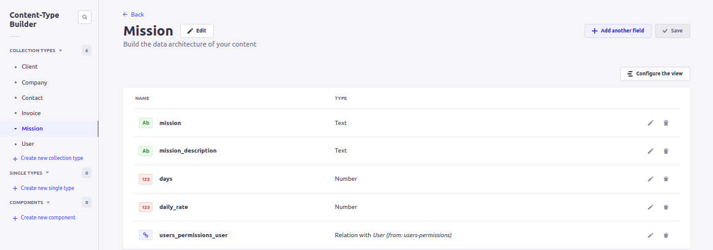
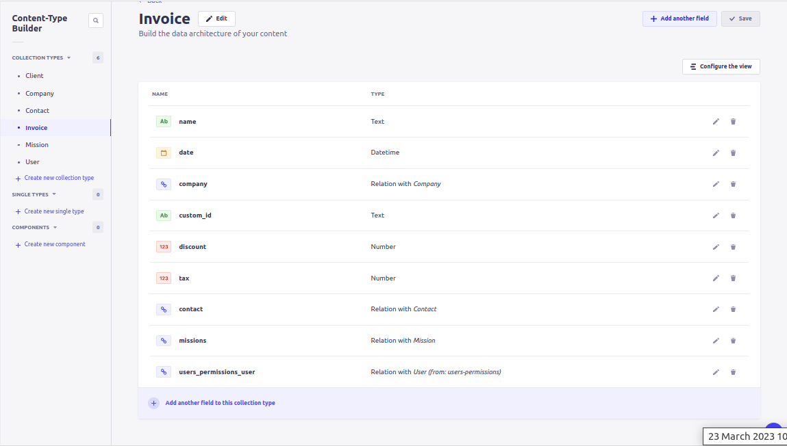
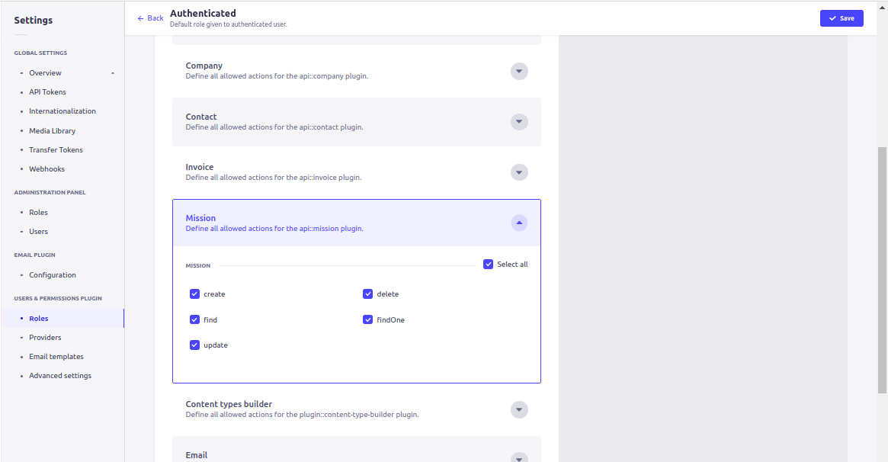
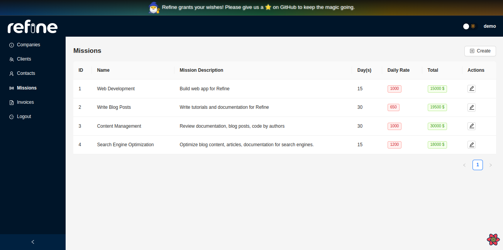
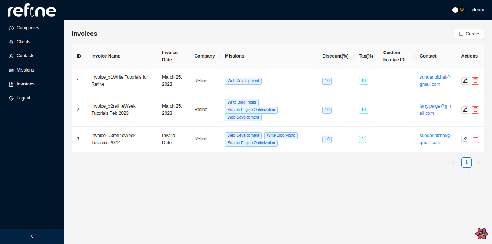

# Creating Mission and Invoice Pages

In this post, we add more CRUD views to the **Pdf Invoice Generator** app we have been building using **refine** last few days. The resources we cover in this episode are: `missions` and `invoices`. We mainly continue leveraging `dataProvider` methods and adding to the `resources` prop as well as associated route definitions.

We are on Day Four of [**refineWeek**]() and this [**refineWeek**]() series is a five-part tutorial that aims to help developers learn the ins-and-outs of **refine**'s powerful capabilities and get going with **refine** within a week.

## Overview

On [Day 3](), we implemented CRUD actions for `companies`, `clients` and `contacts`. We saw that core data hooks such as `useCreate()` are invoked to access corresponding `dataProvider` methods (i.e. `dataProvider.create` method). And more sophisticated hooks like `useSimpleList()` are built on top of low level hooks like `useList()`.

We have used some other higher level hooks, like `useModalForm()`, `useDrawerForm()` and `useTable()` - all of which combine data fetching and UI presentation with **Ant Design** components - making data state management and UI rendering very compact and convenient.

We covered `useTable()` on [Day 3](), and in this post we also use it to list `missions` and `invoices`. So, we will be inspecting some low level code to examine how `useTable()` implements data fetching and UI presentation under the hood. We are going to do the same for `useSelect()`. We also spend some time digging deep into the `<DeleteButton />` component in order to witness how it implements the `dataProvider.delete` method.

But before we move into writing code, we have to define the collections for `missions` and `invoices` in our **Strapi** app. Let's start with them.

## Strapi Collections for `missions` and `invoices`

Let's revisit the ERD for our **Pdf Invoice Generator** app:



We can see from the diagram that `users-permissions.user` should have an optional `has many` association with `missions` and `invoices` each. Also, `invoices` have an open `one-to-many` relation with `missions` with at least one mission mandatory for an invoice. On the other hand, `contacts` should have a `one-to-many` optional relation with `invoices`.

With this in mind, let's go ahead and create collections in our **Strapi** app.

### Strapi `missions` Collection

We should use the `Content-Type Builder` again to define these collections. The `missions` collection should look like this:



### Strapi `invoices` Collection

The `invoices` collection should look as below:



With the collections completed, we should now authorize `authenticated` users to perform CRUD operations on them.

### Strapi Authorization for `authenticated` Role

Like we did before with the `companies`, `clients` and `contacts` collections, we should set permissions for our `authenticated` users to access and perform queries and mutations on the `/missions` and `/invoices` endpoints.

We can do this from the following path in our **Strapi** app: `/admin/settings/users-permissions/roles/1`



We need to set permissions for both `missions` and `invoices`.

With these done, now we can head back to our **refine** app and add resources and routes for these entities.

## Adding `resources` and Routes for `missions` and `invoices`

Back in our `App.tsx`, let's quickly add the resource objects and routes definitions:

```TypeScript
import { Authenticated, GitHubBanner, Refine } from "@refinedev/core";
import { RefineKbar, RefineKbarProvider } from "@refinedev/kbar";

import {
  AuthPage,
  ErrorComponent,
  Layout,
  notificationProvider,
} from "@refinedev/antd";
import "@refinedev/antd/dist/reset.css";
import * as Icons from "@ant-design/icons";

const {
  UserAddOutlined,
  TeamOutlined,
  InfoCircleOutlined,
  SlidersOutlined,
  FileAddOutlined,
} = Icons;

import routerBindings, {
  CatchAllNavigate,
  NavigateToResource,
  UnsavedChangesNotifier,
} from "@refinedev/react-router-v6";
import { DataProvider } from "@refinedev/strapi-v4";
import { BrowserRouter, Outlet, Route, Routes } from "react-router-dom";
import { authProvider, axiosInstance } from "./authProvider";
import { Header } from "./components/header";
import { API_URL } from "./constants";
import { ColorModeContextProvider } from "./contexts/color-mode";
import { CompanyList } from "pages/companies";
import { ClientList } from "pages/clients";
import { ContactList, EditContact } from "pages/contacts";
import { MissionList } from "pages/missions";
import { CreateInvoice, EditInvoice, InvoiceList } from "pages/invoices";

function App() {
  return (
    <BrowserRouter>
      <GitHubBanner />
      <RefineKbarProvider>
        <ColorModeContextProvider>
          <Refine
            resources={[
              {
                name: "companies",
                list: "/companies",
                icon: <InfoCircleOutlined />,
              },
              {
                name: "clients",
                list: "/clients",
                icon: <TeamOutlined />,
              },
              {
                name: "contacts",
                list: "/contacts",
                edit: "/contacts/:id/edit",
                icon: <UserAddOutlined />,
              },
              // highlight-start
              {
                name: "missions",
                list: "/missions",
                icon: <SlidersOutlined />,
            },
            {
                name: "invoices",
                list: "/invoices",
                create: "/invoices/create",
                edit: "invoices/:id/edit",
                icon: <FileAddOutlined />,
            },
            // highlight-end
            ]}
            authProvider={authProvider}
            dataProvider={DataProvider(API_URL + `/api`, axiosInstance)}
            notificationProvider={notificationProvider}
            routerProvider={routerBindings}
            options={{
              syncWithLocation: true,
              warnWhenUnsavedChanges: true,
            }}
          >
            <Routes>
              <Route
                element={
                  <Authenticated fallback={<CatchAllNavigate to="/login" />}>
                    <Layout Header={Header}>
                      <Outlet />
                    </Layout>
                  </Authenticated>
                }
              >
                <Route
                  index
                  element={<NavigateToResource resource="companies" />}
                />
                <Route path="/companies">
                  <Route index element={<CompanyList />} />
                </Route>
                <Route path="/clients">
                  <Route index element={<ClientList />} />
                </Route>
                <Route path="/contacts">
                  <Route index element={<ContactList />} />
                  <Route path="/contacts/:id/edit" element={<EditContact />} />
                </Route>
                // highlight-start
                <Route path="/missions">
                  <Route index element={<MissionList />} />
                </Route>
                <Route path="/invoices">
                  <Route index element={<InvoiceList />} />
                  <Route path="/invoices/create" element={<CreateInvoice />} />
                  <Route path="/invoices/:id/edit" element={<EditInvoice />} />
                </Route>
                // highlight-end
              </Route>
              <Route
                element={
                  <Authenticated fallback={<Outlet />}>
                    <NavigateToResource />
                  </Authenticated>
                }
              >
                <Route
                  path="/login"
                  element={
                    <AuthPage
                      type="login"
                      formProps={{
                        initialValues: {
                          email: "demo@refine.dev",
                          password: "demodemo",
                        },
                      }}
                    />
                  }
                />
              </Route>
              <Route
                element={
                  <Authenticated>
                    <Layout Header={Header}>
                      <Outlet />
                    </Layout>
                  </Authenticated>
                }
              >
                <Route path="*" element={<ErrorComponent />} />
              </Route>
            </Routes>

            <RefineKbar />
            <UnsavedChangesNotifier />
          </Refine>
        </ColorModeContextProvider>
      </RefineKbarProvider>
    </BrowserRouter>
  );
}

export default App;
```

## Adding Views for `missions`

We only have a `list` route for `missions` so let's have a look at what the `<MissionList />` component entails.


### refine `list` View for `missions`

The `<MissionList />` component looks like this:

```TypeScript
// src/pages/missions/list.tsx

import { List, useTable, TagField, useModalForm, EditButton } from "@refinedev/antd";
import { Table } from "antd";

import { IMission } from "interfaces";
import { CreateMission, EditMission } from "components/mission";

export const MissionList: React.FC = () => {
    const { tableProps } = useTable<IMission>();

    const { formProps, modalProps, show } = useModalForm({
        resource: "missions",
        action: "create",
    });

    const {
        formProps: editFormProps,
        modalProps: editModalProps,
        show: editShow,
    } = useModalForm({
        resource: "missions",
        action: "edit",
    });

    return (
        <>
            <List
                createButtonProps={{
                    onClick: () => {
                        show();
                    },
                }}
            >
                <Table {...tableProps}>
                    <Table.Column dataIndex="id" title="ID" />
                    <Table.Column dataIndex="mission" title="Name" />
                    <Table.Column
                        dataIndex="mission_description"
                        title="Mission Description"
                    />
                    <Table.Column dataIndex="days" title="Day(s)" />
                    <Table.Column
                        dataIndex="daily_rate"
                        title="Daily Rate"
                        render={(value) => (
                            <TagField value={value} color="red" />
                        )}
                    />
                    <Table.Column<IMission>
                        title="Total"
                        render={(_, record) => {
                            return (
                                <TagField
                                    value={`${
                                        record?.daily_rate * record?.days
                                    } $`}
                                    color="green"
                                />
                            );
                        }}
                    />
                    <Table.Column<IMission>
                        title="Actions"
                        dataIndex="actions"
                        key="actions"
                        render={(_value, record) => (
                            <EditButton
                                hideText
                                size="small"
                                recordItemId={record?.id}
                                onClick={() => editShow(record?.id)}
                            />
                        )}
                    />
                </Table>
            </List>
            <CreateMission modalProps={modalProps} formProps={formProps} />
            <EditMission
                modalProps={editModalProps}
                formProps={editFormProps}
            />
        </>
    );
};
```

The `useTable()`and `useModalForm()` hooks are already familiar to us, as we have used them on [Day 3](). In short, **refine-Ant Design**'s `useTable()` hook produces for us a set of props inside `tableProps` which is tailored to match the props accepted by **Ant Design**'s `<Table />` component. Similarly, we are picking the `formProps` object exposed by `useModalForm()` hook to be passed to the `<Form />` component, and also the `modalProps` to match the props accepted by `<Modal />` component.

Towards the end of this post, dig into some of these hooks' source code and try to make sense of how **refine** handles all these for us under the hood.

### refine `create` View for `missions`

This is also similar to what we did on [Day 3](). The `create` action for `missions` resource is performed from a `<Form />` inside the `<CreateMission />` view which is basically built on top of a `<Modal />` component.

Thanks to the `createButtonProps` of the `<List />` component, the modal is accessible upon click on a `<CreateButton />`.

The `<CreateMission />` component which accepts and relays `formProps` to `<Form />` and `modalProps` to the `<Modal />` component looks like this:

```TypeScript
// src/components/mission/create.tsx

import { Form, Input, ModalProps, FormProps, Modal, InputNumber } from "antd";

type CreateMissionProps = {
    modalProps: ModalProps;
    formProps: FormProps;
};

export const CreateMission: React.FC<CreateMissionProps> = ({
    modalProps,
    formProps,
}) => {
    return (
        <Modal {...modalProps} title="Create Contact">
            <Form {...formProps} layout="vertical">
                <Form.Item
                    label="Title"
                    name="mission"
                    rules={[
                        {
                            required: true,
                        },
                    ]}
                >
                    <Input />
                </Form.Item>
                <Form.Item label="Description" name="mission_description">
                    <Input />
                </Form.Item>
                <Form.Item label="Day(s)" name="days">
                    <InputNumber defaultValue={1} />
                </Form.Item>
                <Form.Item label="Daily Rate" name="daily_rate">
                    <InputNumber defaultValue={1} />
                </Form.Item>
            </Form>
        </Modal>
    );
};
```

### refine `edit` View for `missions`

The `edit` view is also similar to the `create` view. The `<EditMission />` component looks like this:

```TypeScript
// src/components/mission/edit.tsx

import { Form, Input, ModalProps, FormProps, Modal, InputNumber } from "antd";

type EditMissionProps = {
    modalProps: ModalProps;
    formProps: FormProps;
};

export const EditMission: React.FC<EditMissionProps> = ({
    modalProps,
    formProps,
}) => {
    return (
        <Modal {...modalProps} title="Create Contact">
            <Form {...formProps} layout="vertical">
                <Form.Item
                    label="Title"
                    name="mission"
                    rules={[
                        {
                            required: true,
                        },
                    ]}
                >
                    <Input />
                </Form.Item>
                <Form.Item label="Description" name="mission_description">
                    <Input />
                </Form.Item>
                <Form.Item label="Day(s)" name="days">
                    <InputNumber defaultValue={1} />
                </Form.Item>
                <Form.Item label="Daily Rate" name="daily_rate">
                    <InputNumber defaultValue={1} />
                </Form.Item>
            </Form>
        </Modal>
    );
};
```

It's render is trigerred by a click on the `<EditButton />` placed inside a `<Table.Column />` element in the `<MissionList />` component.

Ok. With these views completed, we should be able to create, list and show `missions` records from our app.



## Adding Views for `invoices`

For the `invoices` resource, we have three routes and each path has its own view. Let's start with again with the `list`.

### refine `list` View for `invoices`

The `<InvoiceList />` rendered at `/invoices` looks like this:

```TypeScript
// src/pages/invoices/list.tsx

import { useState } from "react";
import { useModal } from "@refinedev/core";
import { List, useTable, DateField, TagField, EmailField, DeleteButton, EditButton } from "@refinedev/antd";

// It is recommended to use explicit import as seen below to reduce bundle size.
// import { IconName } from "@ant-design/icons";
import * as Icons from "@ant-design/icons";

import { Table, Space, Button, Modal } from "antd";

import { IInvoice, IMission } from "interfaces";
// import { PdfLayout } from "components/pdf";

const { FilePdfOutlined } = Icons;

export const InvoiceList: React.FC = () => {
    const [record, setRecord] = useState<IInvoice>();

    const { tableProps } = useTable<IInvoice>({
        meta: {
            populate: {
                contact: { populate: ["client"] },
                company: { populate: ["logo"] },
                missions: "*",
            },
        }
    });

    const { show, visible, close } = useModal();

    return (
        <>
            <List>
                <Table {...tableProps}>
                    <Table.Column dataIndex="id" title="ID" />
                    <Table.Column<IInvoice>
                        dataIndex="name"
                        title="Invoice Name"
                        render={(_, record) => {
                            return `Invoice_#${record.id}${record?.name}`;
                        }}
                    />
                    <Table.Column<IInvoice>
                        dataIndex="date"
                        title="Invoice Date"
                        render={(value) => (
                            <DateField format="LL" value={value} />
                        )}
                    />
                    <Table.Column
                        dataIndex={["company", "name"]}
                        title="Company"
                    />
                    <Table.Column
                        dataIndex={"missions"}
                        title="Missions"
                        render={(value) => {
                            return value.map((item: IMission) => {
                                return (
                                    <TagField
                                        key={item?.id}
                                        color="blue"
                                        value={item?.mission}
                                    />
                                );
                            });
                        }}
                    />
                    <Table.Column
                        dataIndex="discount"
                        title="Discount(%)"
                        render={(value) => (
                            <TagField color="blue" value={value} />
                        )}
                    />
                    <Table.Column
                        dataIndex="tax"
                        title="Tax(%)"
                        render={(value) => (
                            <TagField color="cyan" value={value} />
                        )}
                    />
                    <Table.Column
                        dataIndex="custom_id"
                        title="Custom Invoice ID"
                    />

                    <Table.Column
                        dataIndex={["contact", "email"]}
                        title="Contact"
                        render={(value) => <EmailField value={value} />}
                    />
                    <Table.Column<IInvoice>
                        title="Actions"
                        dataIndex="actions"
                        render={(_, record) => {
                            return (
                                <Space>
                                    <EditButton
                                        hideText
                                        size="small"
                                        recordItemId={record?.id}
                                    />
                                    <DeleteButton
                                        hideText
                                        size="small"
                                        recordItemId={record?.id}
                                    />
                                </Space>
                            );
                        }}
                    />
                </Table>
            </List>
        </>
    );
};
```

We already covered `useTable()` in a couple of more components earlier, but in this instance pay attention to the `meta.populate` property of the object passed to `useTable()` hook. We can nest the `populate` property in order to get deeply associated collections in our query results:

```TypeScript
const { tableProps } = useTable<IInvoice>({
    meta: {
        populate: {
            contact: { populate: ["client"] },
            company: { populate: ["logo"] },
            missions: "*",
        },
    }
});
```

### refine `create` View for `invoices`

The `<CreateInvoice />` page for `invoices` is accessible from the `<CreateButton />` component that is placed inside the **refine-Ant Design** `<List />` component by default.

The `<CreateInvoice />` view looks like this:

```TypeScript
// src/pages/invoices/create.tsx

import { IResourceComponentsProps } from "@refinedev/core";
import { Create, useForm, useSelect } from "@refinedev/antd";
import { Form, Input, Select, DatePicker } from "antd";

import { ICompany, IContact, IMission, IInvoice } from "interfaces";

export const CreateInvoice: React.FC<IResourceComponentsProps> = () => {
    const { formProps, saveButtonProps } = useForm<IInvoice>();

    const { selectProps: companySelectProps } = useSelect<ICompany>({
        resource: "companies",
        optionLabel: "name",

        pagination: {
            mode: "server"
        }
    });

    const { selectProps: contactSelectProps } = useSelect<IContact>({
        resource: "contacts",
        optionLabel: "first_name",

        pagination: {
            mode: "server"
        }
    });

    const { selectProps: missionSelectProps } = useSelect<IMission>({
        resource: "missions",
        optionLabel: "mission",

        pagination: {
            mode: "server"
        }
    });

    return (
        <Create saveButtonProps={saveButtonProps}>
            <Form {...formProps} layout="vertical">
                <Form.Item label="Invoice Name" name="name">
                    <Input />
                </Form.Item>
                <Form.Item
                    label="Company"
                    name="company"
                    rules={[
                        {
                            required: true,
                        },
                    ]}
                >
                    <Select {...companySelectProps} />
                </Form.Item>

                <Form.Item
                    label="Missions"
                    name="missions"
                    rules={[
                        {
                            required: true,
                        },
                    ]}
                >
                    <Select {...missionSelectProps} mode="multiple" />
                </Form.Item>
                <Form.Item label="Discount(%)" name="discount">
                    <Input />
                </Form.Item>
                <Form.Item label="Tax(%)" name="tax">
                    <Input />
                </Form.Item>
                <Form.Item label="Custom ID" name="custom_id">
                    <Input />
                </Form.Item>
                <Form.Item
                    label="Contact"
                    name="contact"
                    rules={[
                        {
                            required: true,
                        },
                    ]}
                >
                    <Select {...contactSelectProps} />
                </Form.Item>
                <Form.Item label="Invoice Date" name="date">
                    <DatePicker style={{ width: "50%" }} />
                </Form.Item>
            </Form>
        </Create>
    );
};
```

There are a couple of things important in the code above. First, the use of `<Create />` component, which consumes the `saveButtonProps` object extracted from the `useForm()` hook. And secondly, the use of the `useSelect()` hook. We'll come to `useSelect()` in the next section about `edit` view but notice that multiple `useSelect()` hooks are used to fetch data from the **Strapi** backend, before they can be added to different fields of the form to create a new `invoices` entry.

**refine `create` Component**

The `<Create />` component by default places a **refine-Ant Design** `<SaveButton />` component as its child and `saveButtonProps` are passed to it. `saveButtonProps` include props for the form action, button loading and disabling states. Here, when the `<SaveButton />` is clicked `formProps.onFinish()` is triggered, which eventually invokes the `dataProvider.create` method via `useCreate()`.

For the details about how the `<SaveButton />` works, feel free to read through the [docs here]().

### refine `edit` Views for `invoices`

The `<EditInvoice />` page is more or less the same as the `create` view. Its content looks as below:

```TypeScript
// src/pages/invoices/edit.tsx

import { IResourceComponentsProps } from "@refinedev/core";
import { useForm, useSelect, Edit } from "@refinedev/antd";
import { Form, Input, Select } from "antd";

import { IInvoice } from "interfaces";

export const EditInvoice: React.FC<IResourceComponentsProps> = () => {
    const { formProps, saveButtonProps, queryResult } = useForm<IInvoice>({
        meta: { populate: ["company", "contact", "missions"] },
    });

    const defaultValue = queryResult?.data?.data;

    const { selectProps: companySelectProps } = useSelect({
        resource: "companies",
        defaultValue: defaultValue?.company.id,
        optionLabel: "name",

        pagination: {
            mode: "server"
        }
    });

    const { selectProps: contactSelectProps } = useSelect({
        resource: "contacts",
        defaultValue: defaultValue?.contact?.id,
        optionLabel: "first_name",

        pagination: {
            mode: "server"
        }
    });

    const { selectProps: missionSelectProps } = useSelect({
        resource: "missions",
        optionLabel: "mission",

        pagination: {
            mode: "server"
        }
    });

    return (
        <Edit saveButtonProps={saveButtonProps}>
            <Form {...formProps} layout="vertical">
                <Form.Item label="Invoice Name" name="name">
                    <Input />
                </Form.Item>
                <Form.Item
                    label="Company"
                    name={["company", "id"]}
                    rules={[
                        {
                            required: true,
                        },
                    ]}
                >
                    <Select {...companySelectProps} />
                </Form.Item>

                <Form.Item
                    label="Mission"
                    name={["missions"]}
                    rules={[
                        {
                            required: true,
                        },
                    ]}
                >
                    <Select {...missionSelectProps} mode="multiple" />
                </Form.Item>
                <Form.Item label="Discount(%)" name="discount">
                    <Input />
                </Form.Item>
                <Form.Item label="Tax(%)" name="tax">
                    <Input />
                </Form.Item>
                <Form.Item label="Custom ID" name="custom_id">
                    <Input />
                </Form.Item>
                <Form.Item
                    label="Contact"
                    name={["contact", "id"]}
                    rules={[
                        {
                            required: true,
                        },
                    ]}
                >
                    <Select {...contactSelectProps} />
                </Form.Item>
            </Form>
        </Edit>
    );
};
```

This time, the `meta.populate` property includes multiple associated resources in the query results.

<br />

**refine `useSelect()` Hook**

We are using multiple `useSelect()` hooks that allow us fetch `companies`, `missions` and `contacts` data and avail them to `<Form.Item />`s. Under the hood, a `useSelect()` hook counts on the `useList()` data hook to access and invoke the `dataProvider.getList` method for fetching data from our **Strapi** backend. The argument object passed is, therefore, the same as that of `useList()`. For more details, please see [the `useSelect()` API reference here]().

With these components added, we should be able to create, list and edit invoices.



## Low Level Inspection

We have used several high level **refine-Ant Design** hooks so far in this series. Namely, `useSimpleList()`, `useModalForm()`, `useDrawerForm()`, `useTable()` and `useSelect()`. Their internal implementations are pretty sophisticated according to the specific requirements they fulfill, both in terms of data fetching and UI presentation.

In the following sections, we zoom in on the low level implementation of `useTable()`, `useSelect()` hooks and `<CreateButton />` component. This is to shed some light into the tremendous tasks accomplished by **refine** hooks and components behind the scenes. This should guide us enough to examine other hooks and components mentioned above. They are available inside the `node_modules/@refinedev/antd` directory.

### refine-Ant Design `useTable()` Hook

We mentioned that `useTable()` is built on top of `useList()`, which is indirectly true. This is because **refine**'s core module also has a `useTable()` hook. We are using **refine-Ant Design**'s `useTable()` hook here, which is actually built on top of the core `useTable()` hook.

Endowed a due patience, we can see this in action among many others in the `@refinedev/antd` folder for `useTable()`:

```TypeScript
// Inside node_modules/@refinedev/antd/src/hooks/table/useTable/useTable.ts

const {
        tableQueryResult,
        current,
        setCurrent,
        pageSize,
        setPageSize,
        filters,
        setFilters,
        sorters,
        setSorters,
        sorter,
        setSorter,
        createLinkForSyncWithLocation,
        pageCount,
    } = useTableCore<TData, TError>({
        permanentSorter,
        permanentFilter,
        initialCurrent,
        initialPageSize,
        pagination,
        hasPagination,
        filters: filtersFromProp,
        sorters: sortersFromProp,
        initialSorter,
        initialFilter,
        syncWithLocation,
        resource,
        defaultSetFilterBehavior,
        successNotification,
        errorNotification,
        queryOptions,
        liveMode: liveModeFromProp,
        onLiveEvent,
        liveParams,
        meta: pickNotDeprecated(meta, metaData),
        metaData: pickNotDeprecated(meta, metaData),
        dataProviderName,
    });
```

Then, it's the core `useTable()` hook that is leveraging `useList()` data hook in order to invoke the `dataProvider.getList` method:

```TypeScript
// Inside node_modules/@refinedev/core/src/hooks/useTable/index.ts

const queryResult = useList<TData, TError>({
    resource: resourceInUse,
    hasPagination,
    pagination: { current, pageSize, mode: pagination?.mode },
    filters: unionFilters(preferredPermanentFilters, filters),
    sorters: unionSorters(preferredPermanentSorters, sorters),
    queryOptions,
    successNotification,
    errorNotification,
    meta: preferredMeta,
    metaData: preferredMeta,
    liveMode,
    liveParams,
    onLiveEvent,
    dataProviderName,
});
```

Then, among others inside the gigantic returned object, the `tableProps` property conforms to the props that are accepted by the [**Ant Design** `<Table />` component]():

```TypeScript
return {
    // ...
    tableProps: {
        dataSource: data?.data,
        loading: liveMode === "auto" ? isLoading : !isFetched,
        onChange,
        pagination: antdPagination(),
        scroll: { x: true },
    },
    // ...
};
```

### refine-Ant Design `useSelect()` Hook

The `useList()` hook is also being utilized **for** the `useSelect()` **refine-Ant Design** hook, but inside the core `useSelect()` hook which then plays its role inside the higher level `@refinedev/antd` version.

The source code of `useSelect()` inside `@refinedev/antd` package uses `useSelectCore()` in the following snippet:

```TypeScript
// node_modules/@refinedev/antd/src/hooks/field/useSelect/index.ts

const { queryResult, defaultValueQueryResult, onSearch, options } =
    useSelectCore(props);

return {
    selectProps: {
        options,
        onSearch,
        loading: defaultValueQueryResult.isFetching,
        showSearch: true,
        filterOption: false,
    },
    queryResult,
    defaultValueQueryResult,
};
```

Inside the core version, `useList()` is key to fetching data from the backend API:

```TypeScript
// node_modules/@refinedev/core/src/hooks/useSelect/index.ts

const queryResult = useList<TData, TError>({
    resource,
    sorters: pickNotDeprecated(sorters, sort),
    filters: filters.concat(search),
    pagination: {
        current: pagination?.current,
        pageSize: pagination?.pageSize ?? fetchSize,
        mode: pagination?.mode,
    },
    hasPagination,
    queryOptions: {
        ...queryOptions,
        onSuccess: (data) => {
            defaultQueryOnSuccess(data);
            queryOptions?.onSuccess?.(data);
        },
    },
    successNotification,
    errorNotification,
    meta: pickNotDeprecated(meta, metaData),
    metaData: pickNotDeprecated(meta, metaData),
    liveMode,
    liveParams,
    onLiveEvent,
    dataProviderName,
});
```

The returned object is tailored to match [the props of the **Ant Design** `<Select />` component]():

```TypeScript
return {
    selectProps: {
        options,
        onSearch,
        loading: defaultValueQueryResult.isFetching,
        showSearch: true,
        filterOption: false,
    },
    queryResult,
    defaultValueQueryResult,
};
```

### refine-Ant Design `<DeleteButton />`

The `<DeleteButton />` implements `useDelete` directly. In `@refinedev/antd` `v5.1.2`, it is invoked like so:

```TypeScript
// Inside node_modules/@refinedev/antd/src/components/buttons/delete/index.tsx

const { mutate, isLoading, variables } = useDelete();
```

And the returned JSX has a `<Popconfirm />` component with an `onConfirm` prop. The delete `mutate` function is passed to `onConfirm` prop, which basically means to invoke `dataProvider.delete` upon confirmation of a delete pop up:

```TypeScript
return (
    <Popconfirm
        // ...
        onConfirm={(): void => {
            if ((recordItemId ?? id) && resource?.name) {
                mutate(
                    {
                        id: recordItemId ?? id ?? "",
                        resource: resource?.name,
                        mutationMode,
                        successNotification,
                        errorNotification,
                        meta: pickNotDeprecated(meta, metaData),
                        metaData: pickNotDeprecated(meta, metaData),
                        dataProviderName,
                        invalidates,
                    },
                    {
                        onSuccess: (value) => {
                            onSuccess && onSuccess(value);
                        },
                    },
                );
            }
        }}
        // ...
    </Popconfirm>
);
```

As we can see from the above analysis, in the background, **refine** handles a lot of data heavy tasks, fine-tunes compatibility with popular stable UI components; and in the foreground, it keeps its hooks and elements highly customizable, compact and elegant.

## Summary